------------
Introduction
------------

After installing and configuring the requires back-end services, as explained in the central readme file, Anlzer is ready to be used as a web application by non-IT users that want to gain insights into social media data related to their domain.
 
Anlzer's web application is written in Python using the Django Framework. 

This guide aims to familiarize the end-users with the Specific Enabler's workflows, this is why all basic functionalities are presented here together with screenshots. 

As with all systems of this type, an administrator is expected to perform some less basic tasks, like user management. The level of IT expertise here is in no way on the same level as the one required for the back--end configuration. All actions can be performed through the UI and detailed instructions and screenshots are provided here.

-----------------
Workflow
-----------------

The Unstructured and Social Data Analytics SE provides a web interface to allow for users interaction. The workflow that applies from an interface perspective when a user interacts with the U-SDA SE is depicted in Figure 3.
 
 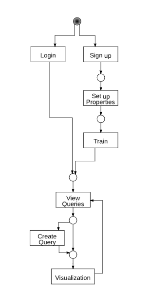
Figure 3: User interaction workflow

----------------------
Project Initialization
----------------------

When a user accesses the FITMAN-Anlzer Specific Enabler, he views the welcome page depicted in Figure 4. He may either login if he already has an account or sign up for a new account.
 
 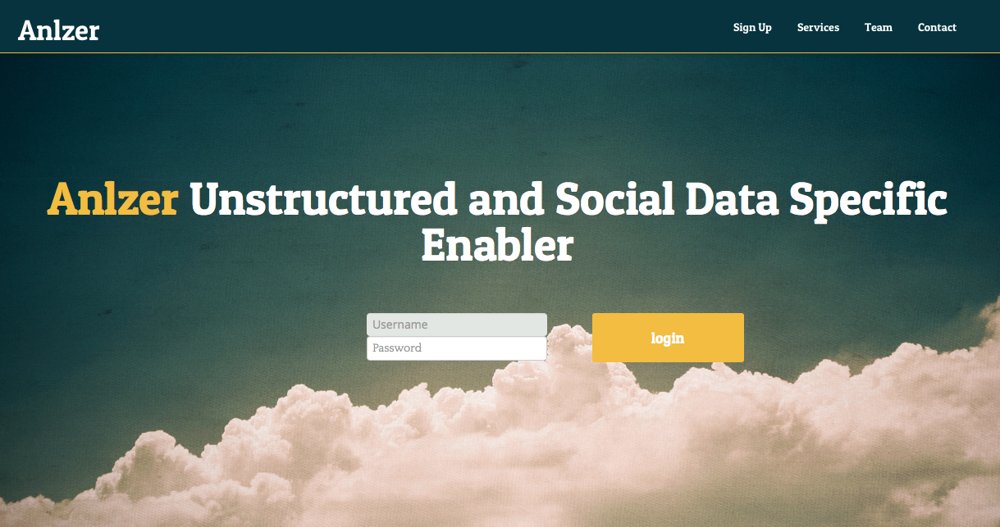
Figure 4: Welcome page

> The _first_ project that will be created in Anlzer is considered to be the master project, i.e. this is the project that controls the data retrieval settings. After creating the first project, contact your system admin in order to start the data retrieval processes. 	
	
When a user signs up in the FITMAN-Anlzer, initially he has to setup his user profile information. He thus chooses his credentials (username and password) and provides his email as depicted in Figure 5.
 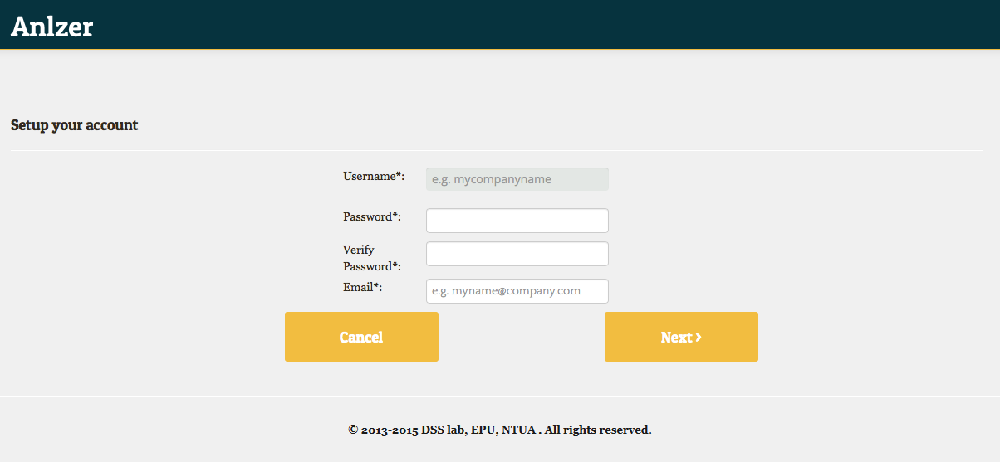
Figure 5: User sign-up

As soon as the registration is completed, the user may create a project in FITMAN-Anlzer according to his needs and preferences. At the moment, only one project per account is allowed. The user chooses a project name and indicates what information he is interested to track from the web: Twitter accounts, Facebook pages, Keywords and Hashtags. (Figure 6).

Note that after creating and configuring a project, the system administrator should be contacted in order to start the procedures that collect data from social media. This is to prevent unauthorized accesses that could lead to system errors and performance issues.

 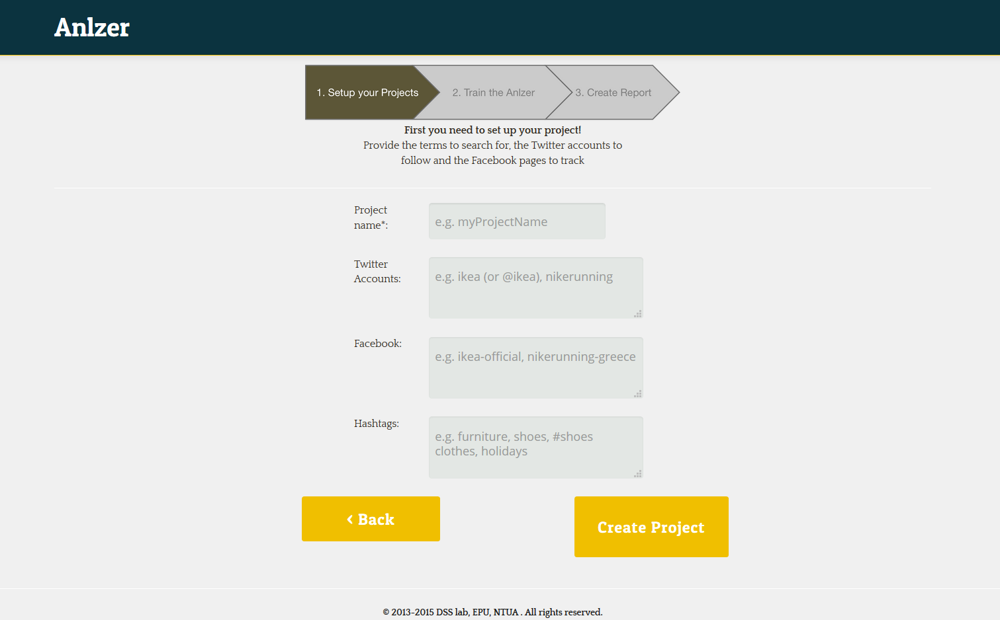
Figure 6: Project set-up

Then, a user visits his central project page where all the created reports are stored (i.e. structured reports on existing data that have been collected in the back-end based on the project's settings and in which the user is interested to navigate). When visiting the FITMAN-Anlzer for the first time, the user views Figure 7, otherwise he navigates to Figure 8 where he can manage a set of already created reports, search for specific terms or order them according to their name, keywords, accounts, etc. By clicking on a report name, the user may view its settings and results.

------------------
Anlzer's main menu
------------------

On the top menu, the following options are provided to the user:
*	Project Setup, used to modify the connectors' and project's settings.
*	Training, through which he can train the Sentiment Analysis Engine for his project purposes.
*	Free Search, that allows him to have a glimpse of all data real-time (without requesting any particular structured query).
*	About, used to access further information regarding the FITMAN-Anlzer
*	Contact, which brings up a contact form to provide feedback to the SE owner.
*	Logout, which is used to log out of the service.

 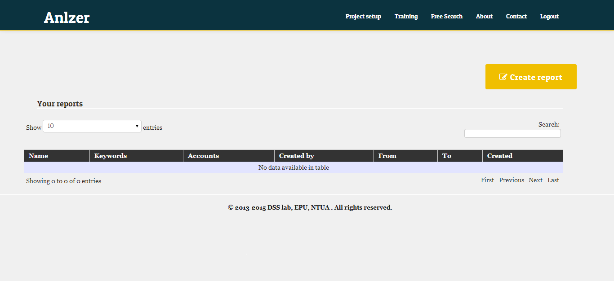
Figure 7: Reports Overview (1st time)

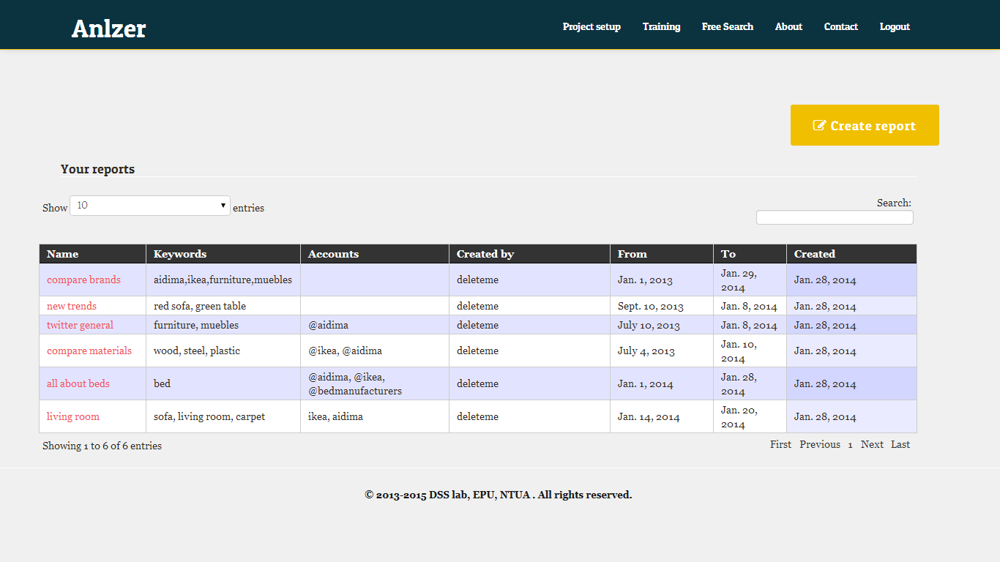 
Figure 8: Reports Overview

-------------------------------------------------
Training the Sentiment Analysis System
---------------------------------------

After the creation of a new project in the FITMAN-Anlzer, it is recommended to train the Sentiment Analysis Engine in Figure 9 through two alternative ways:

*	The user may download a .csv file that contains initial data collected in the Processing / Querying Engine, assign to each phrase the sentiment he considers appropriate, and then upload again the updated file.
*	The user may upload a .csv following the instructed format under the *File Upload* area.

The results will propagate after a while to the Processing / Querying Engine as well as to the Trend & Sentiment Analysis Engine.
Please note that for every chosen language, a different training file is required.

> After performing the first system training, you may contact your system administrator in order to start the sentiment analysis engine. By default, the engine is not started when Anlzer is installed, since it needs a sentiment model to exist in order to be applied to the retrieved documents.

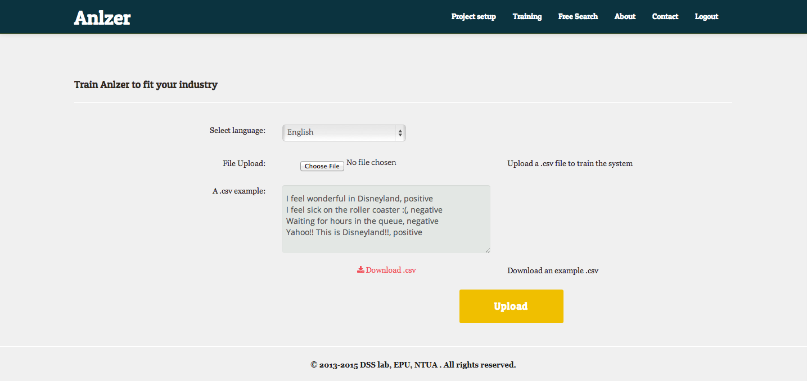 
Figure 9: System Training

---------------------
Creating a new Report
---------------------

In the home screen of FITMAN-Anlzer (Figure 7, Figure 8), the user has the potential to *create a report* by clicking on the corresponding button, thus creating a new report on existing data in Figure 10.

By creating a report, the user provides a name to the report, designates specific keywords and accounts he is interested to track. Finally, he has to choose the time period over which the FITMAN-Anlzer will conduct the analysis of the collected data.

The FITMAN-Anlzer allows the user to customize the reports according to his needs through the *Add Properties* functionality that permits him to add new categories the values of which will be used to filter and organize the results (e.g. category name "colors" with properties "red, black, white", or category name "countries" with properties "Greece, Spain, UK").
All such properties in a report help the user to group and visualize the collected data in a more concrete and substantial way.

 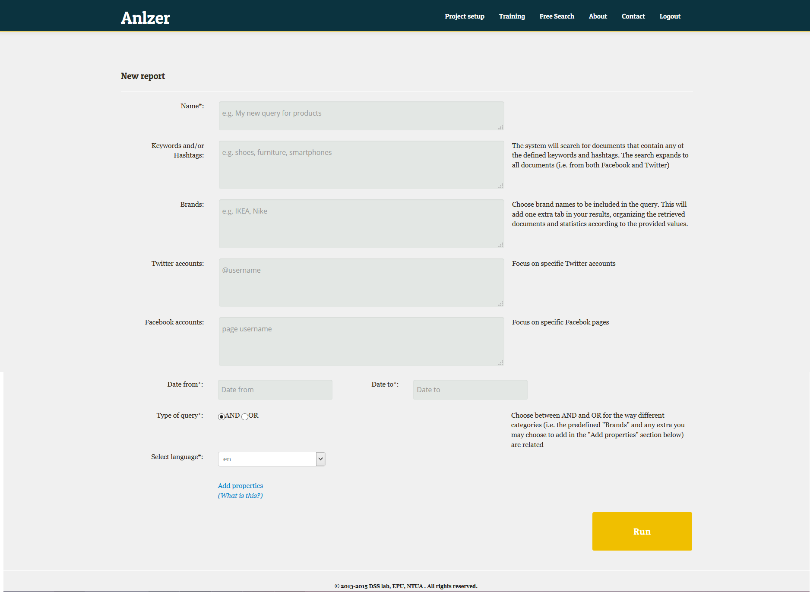
Figure 10: Create New Query

--------------------------
Navigating inside a report
--------------------------

When a user creates a report, he is able to navigate to the report results that include:

1.	The Sentiment Analysis dashboard (Figure 11) where all the messages (that fulfill the query preconditions) are presented along with a sentiment tag (Positive, Negative, Neutral). The user may filter them by specific terms, or even change the sentiment to re-train the Trend & Sentiment Analysis Engine and make it more accurate to his industry. By clicking on the save button the changes will be stored in the Processing Engine, thus propagating the changes in the sentiment tags.

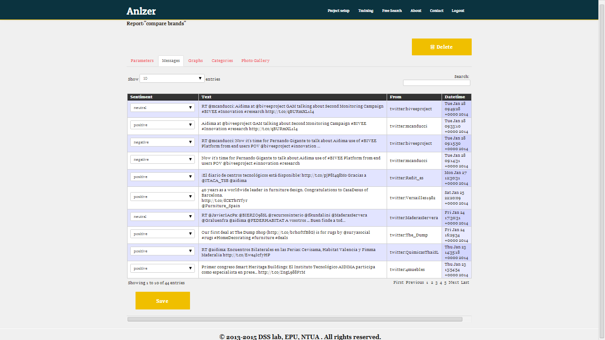 
Figure 11: Sentiment Dashboard

2.	The Sentiment Tree Map (Figure 12) which is organized according to the categories of the report the user has selected. By clicking on the different areas of this tree map, the user is able to see the volume of messages (as suggested by the surface area), and the prevailing aggregated sentiment of the corresponding category and term (with greener colour indicative of bigger influence on the overall positive sentiment).
    The Sentiment Analysis Pie (also in Figure 12) visualizes the sentiment of all the filtered messages.
    The Bubble Chart (also in Figure 12) that provides a quick and comprehensive overview of the intensity of retrieved results per keyword per category (represented by the bubble size) and their scatter over the 2-dimensional (positive,negative) space.

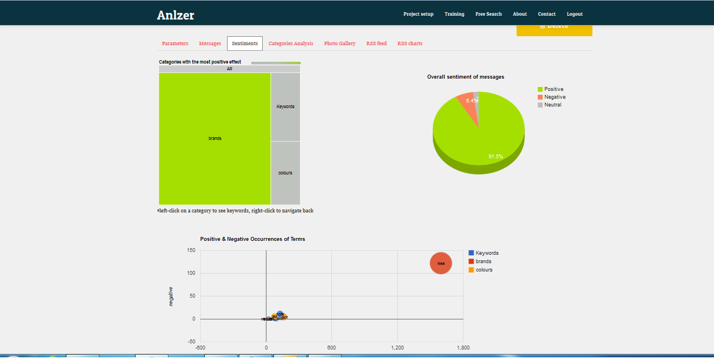 
Figure 12: Sentiment Tree Map and Pie

A Trending Topics Chart visualizing the frequency of appearance of different terms, for the different categories (Figure 13). Going through the tabs, a set of chart pies with the portion and number of term appearance per category are accessible. As expected, the more terms used or extra categories are created, the more tabs become automatically visible. However, the user should have in mind that when he selects more and more properties to filter the collected data, the results may become more and more restricted, thus fewer results are to become visible on the graphs.

 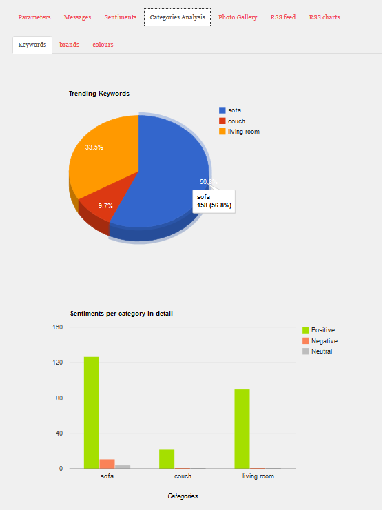 
Figure 13: Trending Topics Chart

A Trending Photo Gallery (Figure 14) presenting all media links that are present in the filtered messages. By browsing the gallery, a user may find important trends for the industry in a visual manner. The frequency of appearance of a photo depends on the times it is retweeted. In cases when the photo is removed from the initial URL, a broken link appears.

 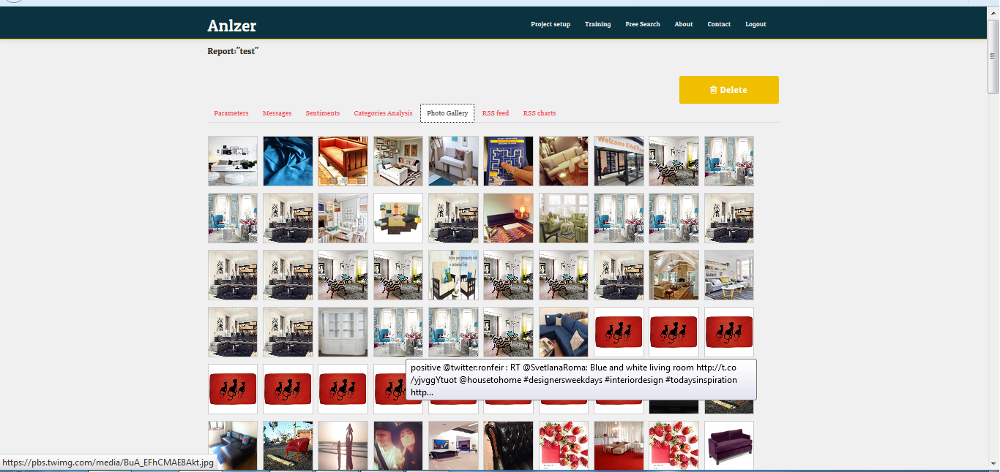 
Figure 14: Trending Photo Gallery

---------------------------------
Free Search inside FITMAN-Anlzer
---------------------------------

In order to exploit the FITMAN-Anlzer in the most efficient and productive way, it is essential to find the proper terms in order to create reports. In order to facilitate this procedure for the user, a "free search" functionality is offered which allows him to see a real-time visual representation of the collected data, where new terms can be unveiled. In Figure 15, a user can add new terms to investigate and view their frequency. Such data can be available almost real-time, as soon as they are tracked from the connectors, stored and processed.
Nevertheless, the changes made on this screen are not stored, as its intended use is to provide an interface to explore and recognize uncommon and un-thought patterns. If a user needs a more clear view of the results, he needs to go back to the home page (Figure 7, Figure 8) and create new reports, with the terms he is interested to track and monitor.

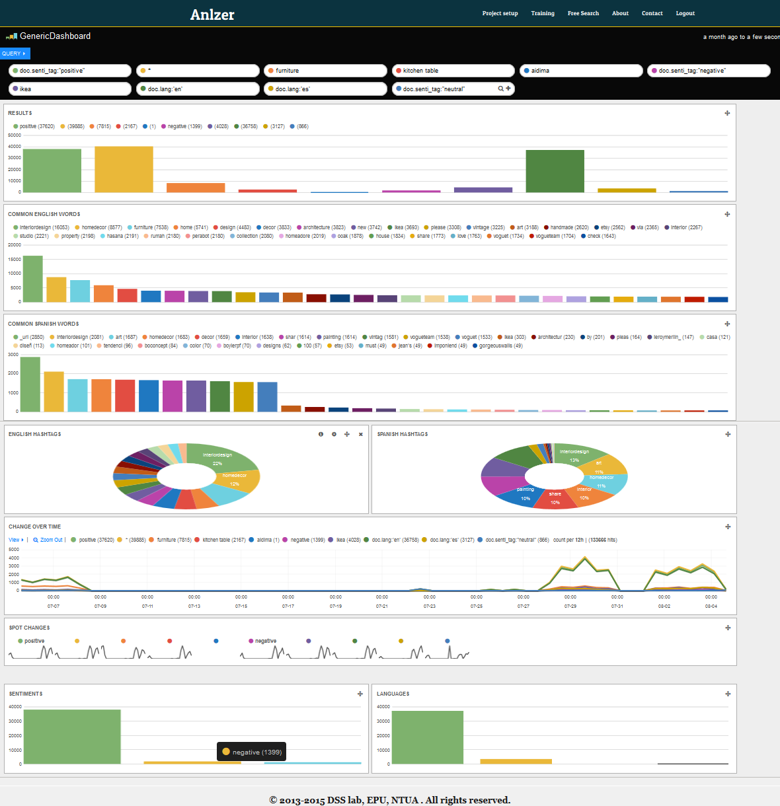 
Figure 15: Free Search

--------------
Error messages
--------------

While using Anlzer, it is possible that you will encounter problems with the previously described workflow. This section shows some basic error messages the system may print on your screen, as well as the problem these error messages probably indicate and the way to overcome it.

Most of the error messages are intended to guide you through the Anlzer's procedures and therefore are self-explanatory. The errors presented here are system errors for which you cannot directly do something to overcome. They are presented here so that you are ready to identify them, should you ever need to, in order to contact the system administrator.

1.	Updating project settings
a.	Not enough privileges error
When trying to update your project settings you may see the following screen:

 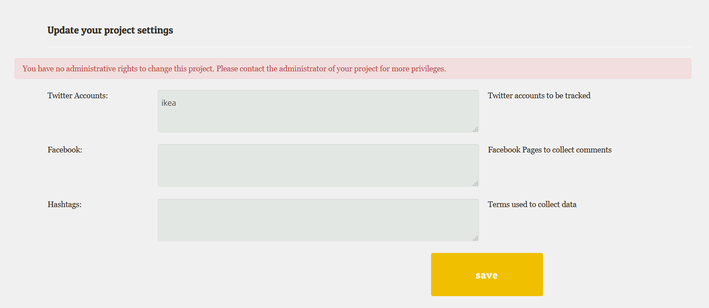 
Figure 16: Permission error on system settings

This means you do not have permission to change the underlying project settings. By default, all new users are only given the rights to create reports and view the results. You need to contact your system administrator and ask that you become stuff member in this project in order to have elevated rights.

2.	Training the sentiment analysis component
Sentiment analysis on the collected data is performed using Support Vector Machines, which is a type of supervised machine learning, i.e. requires proper training before being applied to new data. In order to train the system, you need to upload an appropriate training file, following the instructions on the screen. However, you may encounter the following error when trying to upload the file:
 
 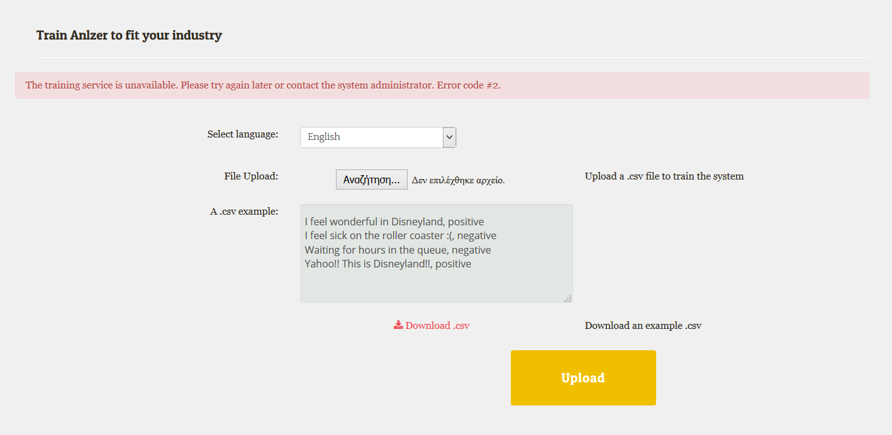 
Figure 18: Error on system training

This error indicates a problem with the training file or the sentiment analysis engine running in the background. You should contact your system administrator in order to resolve this issue.

